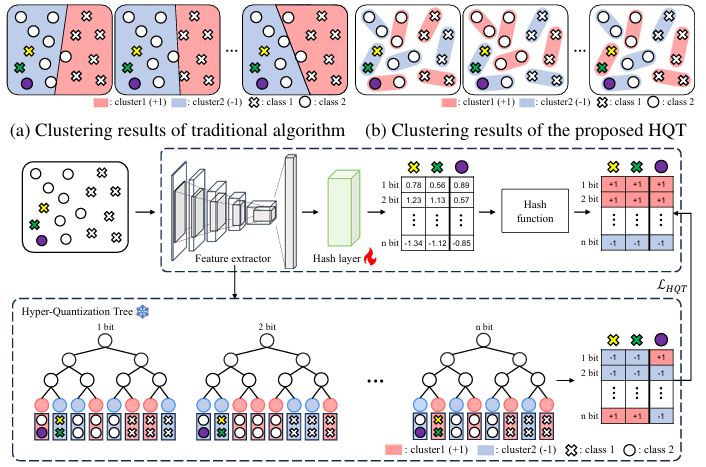

# HQT: Unsupervised Hashing Network with Hyper Quantization Tree
---
This repository contains PyTorch-based implementation of accepted BMVC 2024 paper: [Unsupervsied Hashing Network with Hyper Quantization Tree.](https://bmvc2024.org/proceedings/482/)
> Unsupervised Hashing Network with Hyper Quantization Tree<br/>
> Sungeun Kim, Jongbin Ryu<br/>
> The British Machine Vision Conference (BMVC), 2024<br/>

<p align="center">
 
</p>

## Train scripts
- HQT+BihalfNet(CIFAR10-I)
```bash
python train.py --data-path ../datasets --dataset-type cifar10 --num-train 5000 --num-query 10000 \
  --hash-model bihalf --hqt -c 16 -l 1e-4 -b 64 -m 0.9 -a vgg16 -e 300 -w 8 --weight-decay 5e-4  \
  --lr-decay 120 --gamma 6 --test-map 10
``` 

- HQT+BihalfNet(CIFAR10-II)
```bash
python train.py --data-path ../datasets --dataset-type cifar10 --num-train 50000 --num-query 10000 \
  --hash-model bihalf --hqt -c 16 -l 1e-4 -b 64 -m 0.9 -a vgg16 -e 300 -w 8 --weight-decay 5e-4  \
  --lr-decay 120 --gamma 6 --test-map 10 --topk 1000
```

## Validation
We provide cifar10 implementation for bihalfnet and 16bit checkpoints for protocols I and II. \[[LINK](https://drive.google.com/drive/folders/1NFaHGykyNRyphmz3ledmLWj2gotd7d_e?usp=sharing)\]
- HQT+Bihalf(CIFAR10-I)
```bash
python evaluate.py --checkpoint ./hqt_bihalf_cifar10_I_16.pth --num-train 5000 --num-query 10000
```
- HQT+BihalfNet(CIFAR10-II)
```bash
python evaluate.py --checkpoint ./hqt_bihalf_cifar10_II_16.pth --num-train 50000 --num-query 10000 --topk 1000
```
## References
If HQT has been useful in your work, please consider citing it.
```
@inproceedings{Kim_2024_BMVC,
    author    = {Sungeun Kim and Jongbin Ryu},
    title     = {Unsupervised Hashing Network with Hyper Quantization Tree},
    booktitle = {35th British Machine Vision Conference 2024, {BMVC} 2024, Glasgow, UK, November 25-28, 2024},
    publisher = {BMVA},
    year      = {2024},
    url       = {https://papers.bmvc2024.org/0482.pdf}
}
```
## Acknowledgements
We experimented with HQT by [BihalfNet](https://github.com/liyunqianggyn/Deep-Unsupervised-Image-Hashing), [CIBHash](https://github.com/zexuanqiu/CIBHash), [CIMON](https://github.com/luoxiao12/CIMON) and [UHSCM](https://github.com/rongchengtu1/UHSCM) our code is based on their implementation.